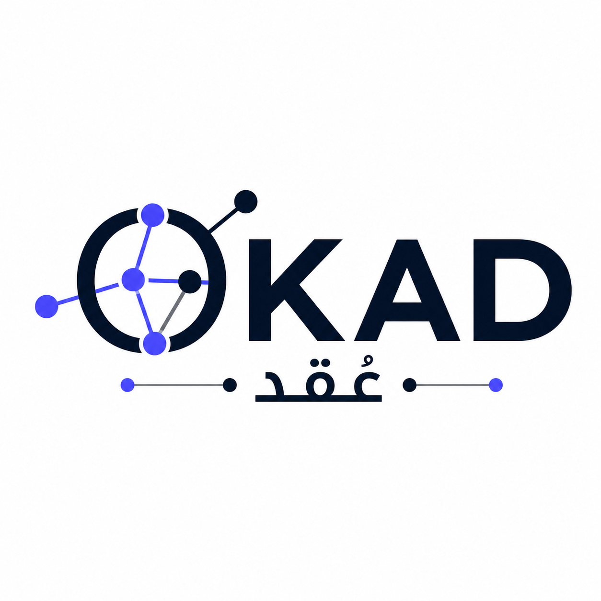

<p align="center">
  
</p>

# OKAD

[](https://github.com/Abmstpha/OKAD/actions/workflows/ci.yml)
[](LICENSE)
[](https://www.python.org/downloads/)
[](docs/agents.md)

**Story-driven architecture maps for any codebase.**

OKAD turns a repo into a readable map of **user journeys**, **request paths**, and **data flows** — layered trees and graphs a stranger can understand.

It works with **Claude Code**, **OpenAI Codex**, **Cursor**, and any agent that can run a skill / slash command. The CLI does the structure; your LLM session writes the story.

> Open `okad-out/story.html` after a run. If someone cannot understand the system from that page, the map failed — not the reader.

| Jump to | |
|---------|---|
| [Download & install](#download--install) | Get the CLI |
| [Run with an LLM app](#run-it-with-an-llm-cli-or-app) | `/okad` in Claude / Codex / Cursor |
| [Examples](examples/) | Mini shop + sample story |
| [Docs](docs/) | Philosophy, design, FAQ, schema |
| [Contributing](CONTRIBUTING.md) | How to help |

---

## Download & install

**One command** (macOS / Linux):

```bash
curl -fsSL https://raw.githubusercontent.com/Abmstpha/OKAD/main/install.sh | bash
```

That installs the `okad` CLI onto your PATH and runs `okad install` (wires `/okad` into Claude / Codex / Cursor).

### Manual (if you prefer)

```bash
# Recommended on Homebrew Macs — --backend pip avoids broken uv/pipx version fights
brew install pipx && pipx ensurepath
pipx install --backend pip "git+https://github.com/Abmstpha/OKAD.git"
export PATH="$HOME/.local/bin:$PATH"
okad install
```

```bash
# Or with a recent uv (0.9.17+)
uv tool install "git+https://github.com/Abmstpha/OKAD.git"
okad install
```

> **Do not** use bare `pip install …` into Homebrew Python — macOS rejects it (`externally-managed-environment`).

### Dev install (from a clone)

```bash
git clone https://github.com/Abmstpha/OKAD.git
cd OKAD
uv venv && source .venv/bin/activate   # Windows: .venv\Scripts\activate
uv pip install -e .
okad version   # → 0.1.0
okad install
```

Re-wire the skill only:

```bash
okad install
okad install --platform cursor    # or: claude | codex | agents
```

More detail: [docs/getting-started.md](docs/getting-started.md) · [docs/agents.md](docs/agents.md)

---

## Run it (with an LLM CLI or app)

OKAD’s full map needs a model. You do **not** set an API key for OKAD — the agent you are already chatting with *is* the model.

### Claude Code

```bash
cd /path/to/your-project
claude                          # start Claude Code in that repo
```

Then type:

```
/okad
```

Or with a path:

```
/okad ./src
```

Claude will: check OKAD → build a skeleton → author journeys/requests/data flows → write `okad-out/story.html`.

### OpenAI Codex

```bash
cd /path/to/your-project
codex
```

Then:

```
/okad
```

(If slash commands are unavailable, say: *“Follow the OKAD skill and map this repo.”*)

### Cursor

1. Open the project in Cursor.
2. Open Agent / Chat.
3. Run:

```
/okad
```

or: *“Run the OKAD skill on this codebase.”*

### After it finishes

```bash
okad open .                     # prints path to story.html
open okad-out/story.html        # macOS
xdg-open okad-out/story.html    # Linux
start okad-out/story.html       # Windows
```

In the browser you get four views: **Architecture · Journeys · Requests · Data flow**.

### Ask the map questions (no rebuild)

In the agent:

```
/okad query "How does checkout work?"
/okad path "Checkout" "Order store"
/okad explain "Auth gate"
```

Or in a normal terminal:

```bash
okad query "How does checkout work?"
okad path "Checkout" "Order store"
okad explain "Auth gate"
```

---

## Try the example (no LLM required)

```bash
make example
# or:
okad skeleton examples/mini-shop
cp examples/mini-shop/story.draft.json examples/mini-shop/okad-out/story.draft.json
okad finalize examples/mini-shop
open examples/mini-shop/okad-out/story.html
```

See [examples/](examples/) for the mini shop and a standalone [sample-story.json](examples/sample-story.json).

---

## Run without an LLM (skeleton only)

Useful for a quick structural preview — no journeys yet:

```bash
cd /path/to/your-project
okad build .
open okad-out/story.html
```

For the full story map, use `/okad` inside Claude Code / Codex / Cursor.

---

## What you get (`okad-out/`)

| File | What it is |
|------|------------|
| `story.html` | Interactive map — open this |
| `STORY_REPORT.md` | Plain-language writeup |
| `story.json` | Queryable story graph |
| `skeleton.md` | Structural seeds the model used |

---

## Documentation

| Doc | |
|-----|---|
| [Getting started](docs/getting-started.md) | Clone → install → `/okad` |
| [Philosophy](docs/PHILOSOPHY.md) | Why story maps beat milky-ways |
| [Design](docs/DESIGN.md) | Pipeline, caps, honesty |
| [Architecture](docs/architecture.md) | Code tour |
| [Schema](docs/schema.md) | `story.json` reference |
| [Agent integration](docs/agents.md) | Claude / Codex / Cursor |
| [FAQ](docs/FAQ.md) | Common questions |
| [Vision](docs/VISION.md) | Where this is going |
| [Roadmap](ROADMAP.md) | Near-term plan |
| [Changelog](CHANGELOG.md) | What shipped |

---

## Full CLI reference

```
okad detect [path]                 # corpus summary
okad skeleton [path]               # structural seeds (routes, screens, stores)
okad finalize [path]               # merge story draft → html + report + json
okad build [path]                  # skeleton map without LLM story
okad query "How does checkout work?"
okad path "Checkout" "Order store"
okad explain "Auth gate"
okad install [--platform claude|codex|cursor|agents|auto]
okad open [path]                   # print story.html path
okad version
```

### How the pipeline works

1. **Detect** source files (skips `node_modules`, secrets, etc.).
2. **Skeleton** extracts architecture-significant signals only — capped per layer.
3. **Story pass** (your LLM via `/okad`) authors journeys, request sequences, and data pipelines with human labels.
4. **Finalize** merges, enforces an elegance cap (~60 nodes), and renders the viz.

---

## Project layout

```text
OKAD/
├── src/okad/          # Python package (CLI + library)
├── skill/             # /okad agent skill
├── examples/          # mini-shop + sample story
├── docs/              # deep documentation
├── tests/             # pytest
├── CONTRIBUTING.md
├── CODE_OF_CONDUCT.md
├── SECURITY.md
├── ROADMAP.md
└── CHANGELOG.md
```

---

## Contributing

PRs welcome — especially extractors, viz clarity, docs, and examples.
Please read [CONTRIBUTING.md](CONTRIBUTING.md) and [CODE_OF_CONDUCT.md](CODE_OF_CONDUCT.md).

```bash
uv pip install -e ".[dev]"
make test
make lint
```

Security reports: [SECURITY.md](SECURITY.md) (not public issues).

---

## License

MIT © [Abmstpha](https://github.com/Abmstpha) — see [LICENSE](LICENSE) and [NOTICE](NOTICE).

**Repo:** https://github.com/Abmstpha/OKAD
